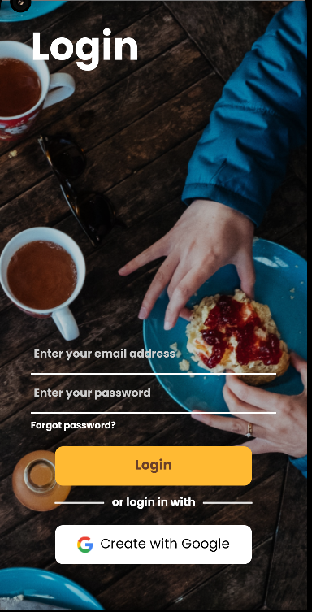
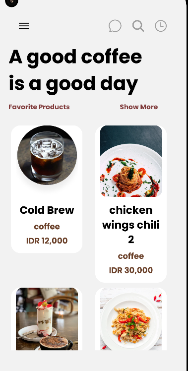
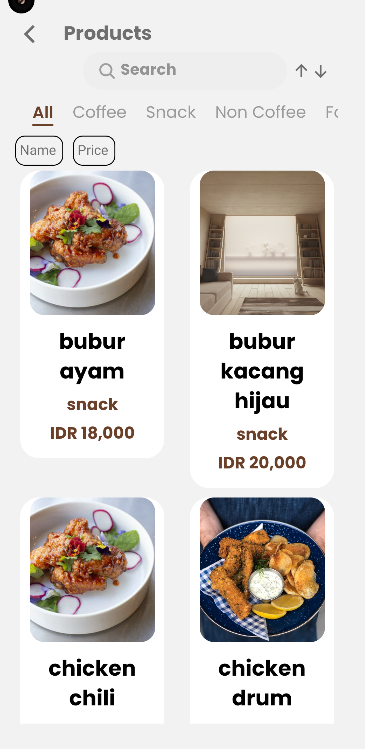
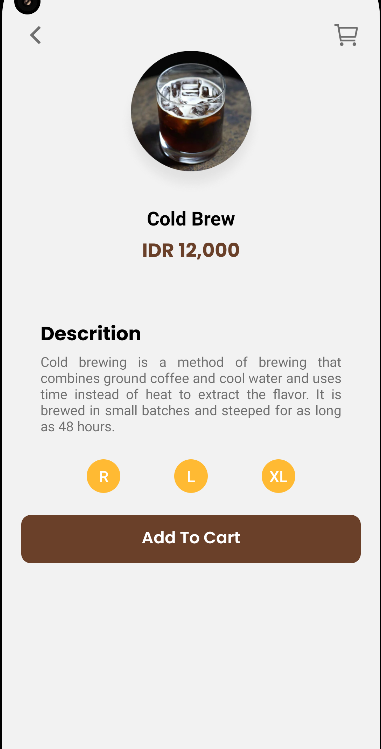
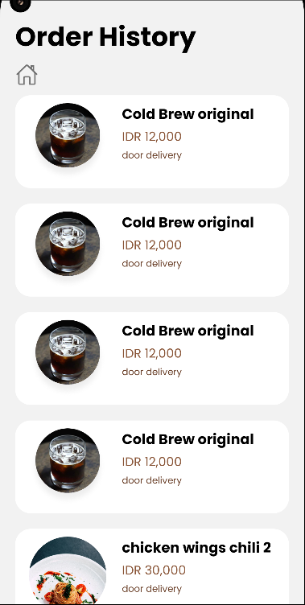
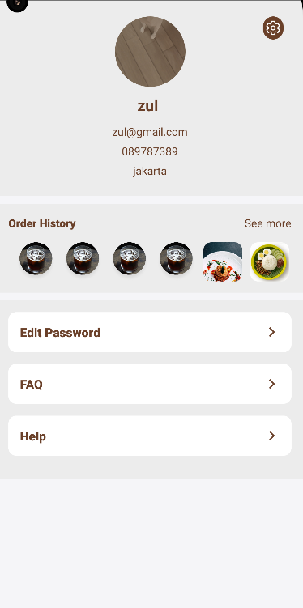

# COFFEE SHOP

### BUILT WITH


[](https://nodejs.org/en/)
[](https://expressjs.com/)
[](https://www.postgresql.org/)
[](https://www.postman.com/)
<br>

[](https://reactjs.org/)
[](https://reactnative.dev/)
[](https://redux.js.org/)

## Getting Started

### Prerequisites

- [NodeJs](https://nodejs.org/)
- [PostgreSql](https://www.postgresql.org/)
- [Postman](https://www.postman.com/)

## HOW TO INSTALL
1. Clone this 2 repository.
    ```
    $ git clone https://github.com/Zulfahmi321/coffee-shop.git
    $ git clone https://github.com/Zulfahmi321/coffee-shop-react-native.git
    ```
2. Open VS Code or you can download and install it [here](https://code.visualstudio.com/).
3. Open menu **Terminal > New Terminal**

4. On terminal, change directory to **coffee-shop-react-native** then run 
    ```
    npx react-native start
    ```

5. Open another terminal, change directory to **coffee-shop-react-native** then run
    ```
    npx react-native run-android

6. Open another terminal, change directory to **coffee-shop** then run
    ```
    npm run startDev
7. Coffe Shop App is Running

## PREVIEW
<div>
<br>
<br>
<br>
<br>

<br>
</div>